<div align="center">



<a href="https://github.com/tpikachu">
  
</a>

<br/>

<a href="mailto:redtortuga91@gmail.com"></a>
<a href="https://stackoverflow.com/users/10909844/tpikachu"></a>


</div>


## 🧬 About Me

```typescript
const tpikachu = {
  role: "Full-Stack Engineer — AI × Blockchain",
  languages: ["TypeScript", "Python", "Rust", "Go", "Solidity"],
  ai: ["LLM apps", "RAG pipelines", "AI Agents", "MCP", "Speech-to-Text"],
  web3: ["Every EVM network & L2", "Solana"],
  fullStack: ["React", "Node.js", "GraphQL", "Electron"],
  currentFocus: ["AI", "Blockchain", "Full-Stack Development"],
  funFact: "My commits are faster than a Pikachu's Quick Attack ⚡",
} as const;
```

- 🤖 &nbsp;Building **AI-powered products** — LLM integrations, RAG pipelines, autonomous agents & MCP servers
- ⛓️ &nbsp;Shipping **smart contracts & dApps** on every EVM chain, L2 rollups and **Solana**
- 🖥️ &nbsp;Delivering **full-stack products** — React/Vue frontends, Node.js/GraphQL backends, Electron desktop apps
- 📊 &nbsp;Indexing on-chain data with **The Graph** and custom indexers
- 💬 &nbsp;Ask me about **TypeScript, LLM tooling, EVM internals, or Electron**


## 🛠️ Tech Arsenal

<div align="center">

### 🤖 AI & LLM Engineering


### 💻 Languages


### 🎨 Frontend & Desktop


### ⚙️ Backend & Databases


### 🚀 DevOps


### ⛓️ Web3 — every EVM network & L2, plus Solana




</div>


## 📊 GitHub Analytics

<div align="center">


</div>


## 🏆 Trophies

<div align="center">


</div>


## 🐍 Contribution Snake

<div align="center">

<picture>
  <source media="(prefers-color-scheme: dark)" srcset="https://raw.githubusercontent.com/tpikachu/tpikachu/output/github-contribution-grid-snake-dark.svg"/>
  <source media="(prefers-color-scheme: light)" srcset="https://raw.githubusercontent.com/tpikachu/tpikachu/output/github-contribution-grid-snake.svg"/>
  
</picture>

</div>

<br/>

<div align="center">

### 💡 Random Dev Quote


<br/><br/>

**Thanks for stopping by! ⚡ Let's build something great together.**


</div>

<!-- Resources -->
<!-- Custom animated SVGs: assets/hero.svg, assets/divider.svg, assets/chains.svg -->
<!-- Typing SVG: https://github.com/DenverCoder1/readme-typing-svg -->
<!-- Skill Icons: https://skillicons.dev -->
<!-- GitHub Stats: https://github.com/anuraghazra/github-readme-stats -->
<!-- Streak: https://github.com/DenverCoder1/github-readme-streak-stats -->
<!-- Activity Graph: https://github.com/Ashutosh00710/github-readme-activity-graph -->
<!-- Trophies: https://github.com/ryo-ma/github-profile-trophy -->
<!-- Snake: https://github.com/Platane/snk -->
<!-- Footer: https://github.com/kyechan99/capsule-render -->
<!-- Shields: https://shields.io -->
