 

## 🎮 Player 1: tpikachu

Full-stack engineer on a main quest through **AI** and **blockchain** — inventory permanently full of side projects.

- ⚡ **Special move** — shipping LLM apps, RAG pipelines & AI agents before the hype cycle ends
- ⛓️ **Current map** — smart contracts & dApps across EVM chains and Solana (fast travel unlocked)
- 🖥️ **Equipment** — React/Vue frontends, Node.js/GraphQL backends, Electron desktop apps (+10 Shipping Speed)
- 🛒 **Merchant guild** — Shopify & eCommerce builds; my checkout flows have a 100% speedrun completion rate
- 🐛 **Battle record** — 999,999 bugs defeated; only 3 were mine (git blame disagrees)
- ☕ **Weakness** — merge conflicts before coffee

## 🗺️ Story Mode

career.exe — based on a true story. The bugs were real.

## 🌳 Skill Tree

All points allocated. No respec available.

| | |
|---|---|
| **Languages** |      |
| **AI & LLM** |          |
| **Web3** |          |
| **E-Commerce** |    |
| **Frontend & Desktop** |      |
| **Backend & Databases** |      |
| **DevOps** |    |

### 🗺️ World Select

All chains cleared. New Game+ unlocked.

## 💬 NPC Wisdom

Random wisdom from a professional dev — new dialogue on every visit. NPCs know things.

## 🐍 Bonus Level

<picture>
  <source media="(prefers-color-scheme: dark)" srcset="https://raw.githubusercontent.com/tpikachu/tpikachu/output/github-contribution-grid-snake-dark.svg"/>
  <source media="(prefers-color-scheme: light)" srcset="https://raw.githubusercontent.com/tpikachu/tpikachu/output/github-contribution-grid-snake.svg"/>
  
</picture>

A snake eats my contributions every night at midnight. This is intentional. Mostly.

🕹️ **CONTINUE?** 9… 8… 7… — <a href="mailto:redtortuga91@gmail.com">**PRESS START**</a> before the countdown ends.

<!-- Resources -->
<!-- Hero, career map, divider, world-select marquee & happy pikachu: custom 8-bit SVGs in assets/ -->
<!-- Badges: https://shields.io -->
<!-- Quote: https://github.com/PiyushSuthar/github-readme-quotes -->
<!-- Snake: https://github.com/Platane/snk (workflow in .github/workflows/snake.yml) -->
